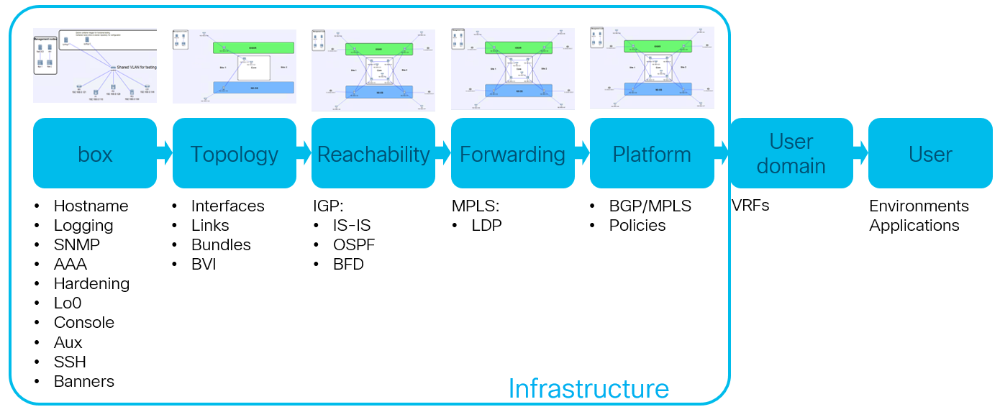

# NetCICD #

NetCICD is an Ansible based toolset to facilitate continuous (…) in networking. The first implementation is made for Cisco devices and uses VIRL for testing, as it allows for multiple concurrent tests to be run. But it is by no means limited to Cisco. All platforms supported by Ansible can be used.

In networking, Continuous Development (CI/CD) is not yet common practice. This is partly caused by lack of familiarity with the CD paradigm and lack of working tooling. NetCICD attempts to fill this void.

NetCICD takes an industrial automation approach to network development and deployment, with as ultimate goal to be able to do CI/CD/CD: 

- Continous Integration of new functionality, including automated testing
- Continuous Delivery of new functionality for deployment to production 
- Continuous Deployment: all new templates and workflows are automagically deployed to production

## Request ##
If you feel you can add to the framework, please do so. 
## License ##
This Source Code Form is subject to the terms of the Mozilla Public License, v. 2.0. If a copy of the MPL was not distributed with this file, You can obtain one at http://mozilla.org/MPL/2.0/.
### Copyright ###
(c) Mark Sibering
## Installing ##
I've writte 4 blogs on preparing the environment:

- [NetCICD - Getting started](https://nl.devoteam.com/en/blog-post/network-automation-getting-started-netcicd/)
- [Preparing VIRL](https://nl.devoteam.com/en/blog-post/network-automation-preparing-virl-netcicd/)
- [Preparing git](https://nl.devoteam.com/en/blog-post/network-automation-preparing-git-netcicd/)
- [Preparing Jenkins](https://nl.devoteam.com/en/blog-post/network-automation-preparing-jenkins-netcicd/)

## Environment ##
In order to test NetCICD, the following test environment is used:

- virl.5i.1.3.296.pc on VMWare Workstation. 
##Topology##
NetCICD deploys the minimal topology required to test functionality. From that standpoint NetCICD uses multiple stages and each stage has a different setup:



Each topology is a [private simulation network](http://virl-dev-innovate.cisco.com/mgt.access.php), so that testing can be done without outside interference. Private simulations create isolated 10.255/16 networks to which all hosts connect their management interface, without an outside link. The NetCICD container in the simulation provides the jumphost to the outside world.

NetCICD assumes the setup used in the blogs, with git, Jenkins and VIRL or CML. 

## Mechanics ##
NetCICD uses Ansible playbooks with roles to deploy configurations to networking equipment. 

Task files in the roles are split into small files imported int the `main.yml` file. This allows for easy maintenance.

As soon as a change is made by Ansible on a device, an Ansible handler is triggered for that host, which entails that additional tasks are run for that host. These tasks are located in the **handlers** folder under the **role** directory. [Normal conditions for the execution of handlers in Ansible](http://docs.ansible.com/ansible/latest/playbooks_error_handling.html#handlers-and-failure) apply.

When a handler is triggered, three things can happen:

- A Behave test scenario is started for that host. These scenarios can be found under the **files/features** folder in the **role** directory. A **files/steps** folder contains the actual tests expressed in Python. The tests use Ansible ad-hoc commands to retrieve state from the device.
- A native Ansible test or assertion
- A PyATS test is run

The NetCICD container has a recent version of PyATS included.

The reachability information required for the ansible ad-hoc commands to run the tests is retrieved from the Ansible hosts file. The tests need to run without user interaction. This requires the server to login based on password-less certificates. If that is not possible, the tests wil fail (the Behave test framework will respond with "Assertion failed").

The templates are located in the **templates** directory and are expressed in Jinja2 format.

Tasks for a role are imported in `main.yml` in the **tasks** directory and import the tasks per subject from the tasks directory.

Role specific variables are located in the **vars** directory under the role. 

### Roles ###
NetCICD uses the following roles:

- box
- topology
- reachability (IGP)
- forwarding (P)
- platform (PE)
- user-domain

#### box ####
Box contains:

- hostname
- banners
- timezone
- clock (timezone, ntp)
- hardening (disabling unused services)
- Loopback0 (incl tftp source)
- ssh
- snmp
- logging
- AAA

The vars directory under the role contains skeleton vars files per stage. This allows to have a different number of log/snmp/aaa servers for each test stage.
#### topology ####
Currently supports configuring Ethernet based interfaces, bundles and subinterfaces. Testing is done with ping.

The vars directory under the role contains skeleton vars files per stage. This allows to have a different topology for each test stage.
#### reachability ####
Work in progress.

#### forwarding ####
Work in progress.

#### platform ####
Work in progress.

#### user-domain ####
Work in progress.
